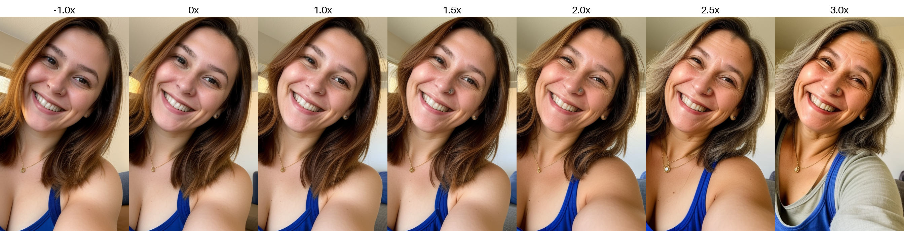

# LoRA Concept Slider

LoRA Concept Slider Inference.

## Table of Contents

- [Requirements](#requirements)
- [Installation](#installation)
- [Usage](#usage)
- [Arguments](#arguments)
- [Example](#example)

## Requirements

- Python 3.9+

## Installation

1. Clone the repository:

    ```sh
    git clone https://github.com/tungdop2/Concept-slider.git
    cd Concept-slider
    ```

2. Install the required packages:

    ```sh
    pip install -r requirements.txt
    ```

## Usage

Run the script with the desired parameters to generate multiple images with different scales of slider. The following sections describe the available arguments and provide an example command.

## Arguments

- `--lora_weight`: Path to the LoRA weights for image generation (required).
- `--scales`: Comma-separated list of scales (default: "-3,-2,-1,1,2,3").
- `--prompts`: Semicolon-separated list of prompts (required).
- `--output_dir`: Directory to save the generated images (default: 'output').
- `--pretrained_model`: Path to the pre-trained model (default: "stablediffusionapi/realistic-vision-v51").
- `--revision`: Model revision (default: None).
- `--device`: Device to use for computation (default: "cuda:0").
- `--weight_dtype`: Data type for model weights (default: "float16").
- `--start_noise`: Start noise for image generation (default: 800).
- `--num_images_per_prompt`: Number of images to generate per prompt (default: 1).
- `--negative_prompt`: Negative prompt for image generation (default: "gray, blackwhite, nude, naked, semi-realistic, cgi, 3d, render, sketch, cartoon, drawing, anime, distorted, ugly").
- `--batch_size`: Batch size for image generation (default: 1).
- `--height`: Height of the generated images (default: 512).
- `--width`: Width of the generated images (default: 512).
- `--ddim_steps`: Number of DDIM steps for image generation (default: 50).
- `--guidance_scale`: Guidance scale for image generation (default: 7.5).

## Pretrained models
Download [Pretrained models](https://drive.google.com/drive/folders/1zxl4WCq4nc0XiJs1a5kLtPzZAtKS5DdM?usp=drive_link) to `models` folder.

## Example

Here is an example command to generate images:

```sh
python infer.py \
    --lora_weight "models/age_slider.pt" \
    --prompts "A selfie of a 30 y.o woman, upper body, smiling, beautiful" \
    --scales "-2, -1, 1, 1.5, 2, 2.5, 3" \
    --output_dir "output" \
    --pretrained_model "stablediffusionapi/realistic-vision-v51" \
    --device "cuda:0" \
    --num_images_per_prompt 5 \
    --negative_prompt "gray, blackwhite, nude, naked, semi-realistic, cgi, 3d, render, sketch, cartoon, drawing, anime, distorted, ugly" \
    --batch_size 1 \
    --height 512 \
    --width 512 \
    --ddim_steps 50 \
    --guidance_scale 7.5
```

